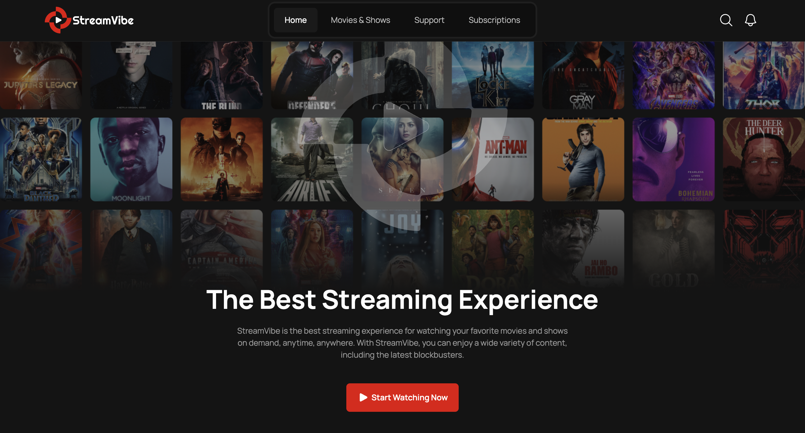
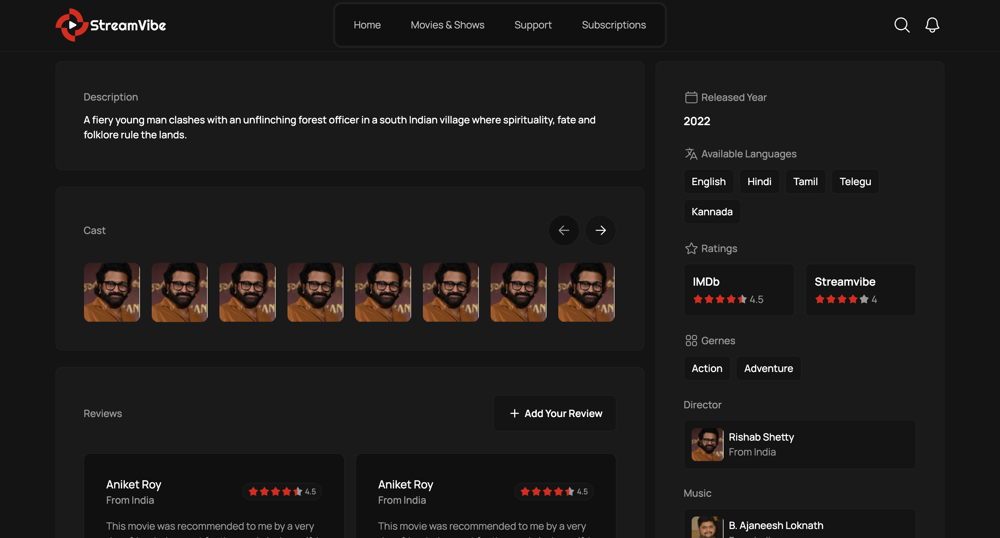
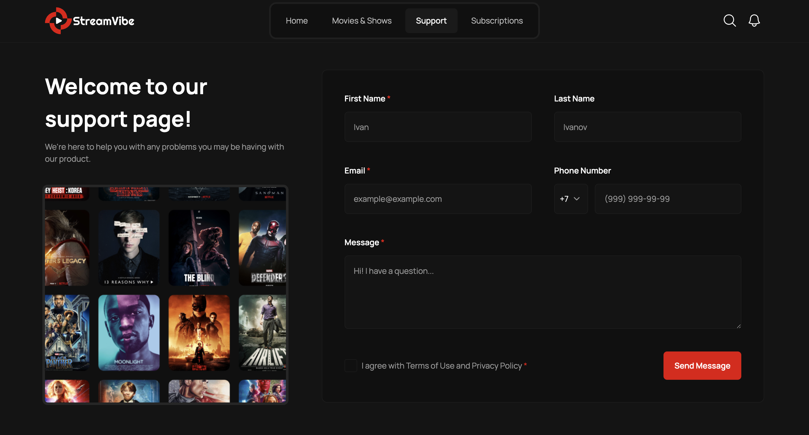
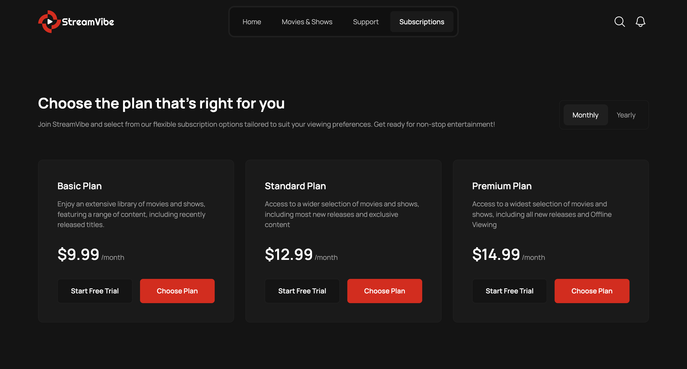

# Stream Vibe



A multi‑page streaming service UI built with JSX, SCSS, and Minista (Vite under the hood). The project showcases component architecture, accessibility, responsive design, asset optimization, and partial hydration.

## Demo
- Vercel: https://stream-vibe-inky.vercel.app/

## Highlights
- **MPA with Minista**: static pages generated for SEO and performance
- **Clean component system**: reusable UI (Button, Cards, Grids, Sliders)
- **Responsive & accessible**: semantic HTML, aria labels, keyboard-friendly
- **Optimized assets**: image breakpoints, SVG sprite, fonts with `woff2`
- **Partial hydration**: interactive islands loaded on demand
- **Consistent styling**: SCSS helpers, variables, normalize, utilities

## Tech Stack
- JSX (without React)
- Minista 3 (Vite), Preact optional for islands
- SCSS (Sass) with project helpers
- PostCSS: `postcss-pxtorem`, `postcss-preset-env`
- Swiper (sliders), IMask (input masks), classnames

## Features (UI)
- Home, Movies & Shows, Movie Details, Subscriptions, Support pages
- Hero section, collections carousels, category grid
- Cards: Movie, Person, Device, Plan, Review, Episode
- Tabs, Accordion, Select, Checkbox, Ratings
- Header with overlay menu, Footer menus, Banner CTA

## Project Structure
```text
src/
  assets/            # images, icons, fonts, videos
  components/        # reusable UI components
  layouts/           # Header, Footer, Content wrappers
  sections/          # page sections (Hero, Collections, Plans, ...)
  pages/             # MPA pages (index.jsx, movies.jsx, ...)
  styles/            # global styles, variables, helpers
  modules/           # JS behaviors (overlay, sliders, video, inputs)
  global.jsx         # HTML shell (Head, layout)
  main.js            # bootstraps interactive modules
```

## Getting Started
```bash
npm install
npm start          # dev server
npm run build      # production build to dist/
npm run preview    # preview build locally
```

## Accessibility
- Proper aria labels and roles where needed
- `aria-current` for active navigation
- Dialog menu prepared for focus handling
- Decorative images use empty `alt` and explicit `width`/`height`

## Performance
- Minista image optimization (breakpoints, `srcset`)
- SVG sprite for icons
- Partial hydration for interactive islands
- PostCSS px-to-rem (prod) and modern CSS via preset-env

## Styling
- SCSS variables in `src/styles/variables.scss`
- Helpers imported globally from `src/styles/helpers`
- Normalize via `@a1rth/css-normalize`

## Scripts
- `npm start`: dev server (Minista)
- `npm run build`: production build
- `npm run preview`: serve build locally

## Screenshots







